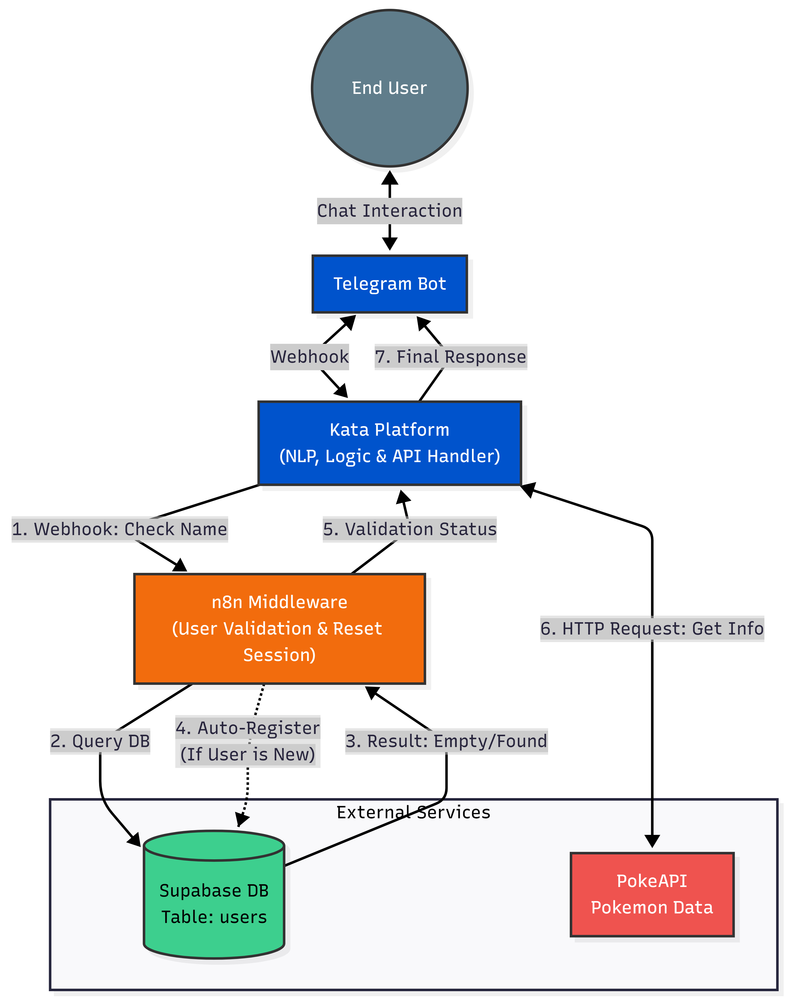
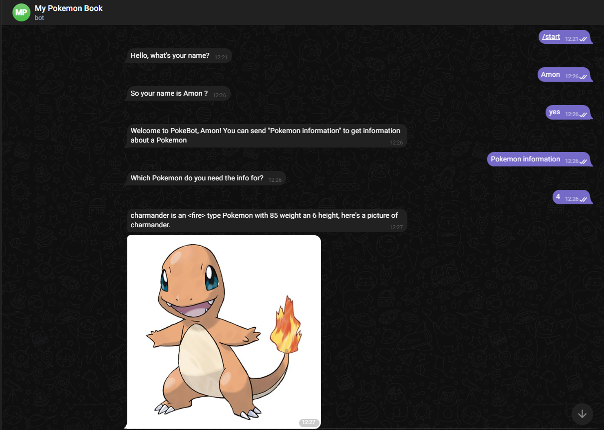
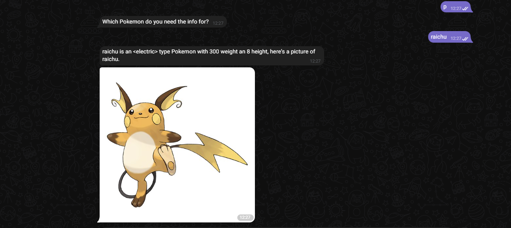
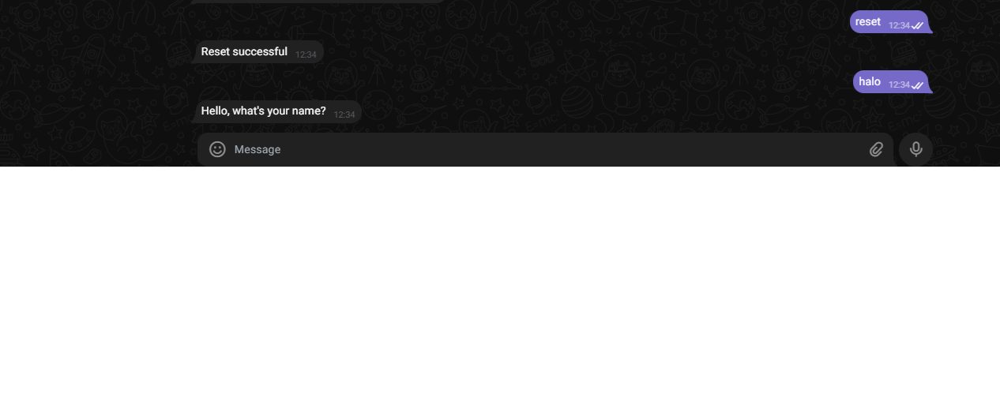

# Pokemon Chatbot Middleware Service

This repository contains the middleware service and configuration files for the **Pokemon Chatbot Project**. The system integrates **Kata Platform** (for Natural Language Processing) with **Supabase** (for user data persistence). 

Specifically, **n8n** is utilized as a middleware to **validate user identity** and handle **automatic registration**. It ensures that every user interacting with the chatbot is checked against the database, and new users are automatically recorded before the conversation proceeds.

## 📝 Submission Details

* **Telegram Bot ID:** @[pokeinf_bot]
* **Chatbot Engine:** Kata Platform (`mybot.yml` included)
* **Middleware Service:** n8n Workflow (`PokeFlow.json`)

## 🚀 Tech Stack

* **Chatbot Interface:** Kata Platform (Supermodel NL)
* **Middleware:** n8n (User Validation & Registration Logic)
* **Database:** Supabase (PostgreSQL)
* **External Data Source:** PokeAPI (Pokemon Information)

## ⚙️ Key Features

1.  **User Validation (Primary Function):**
    * Accepts user input via Webhook from Kata Platform.
    * Queries **Supabase** to check if the `name` already exists.
2.  **Auto-Registration:**
    * If the user is **not found** in the database, n8n automatically **creates a new row** to register them.
    * If the user **exists**, the process continues without duplication.
3.  **Session Management:**
    * Includes a reset mechanism (`PokeFlowReset.json`) to clear user session/flow if needed.

## 🔗 Architecture Overview

The following diagram illustrates the data flow, highlighting n8n's role in user validation:
* **Telegram Bot Link:** https://web.telegram.org/a/#8002434807 
  


## 📷 Telegram Bot Capture

The following image shows the Telegram Bot Capture process:



  

### Logic Flow Description:
1.  **Input:** User sends a message -> Kata Platform.
2.  **Validation (via n8n):**
    * Kata Platform triggers an **n8n Webhook** to check the user's status.
    * n8n queries **Supabase**. If the user is new, n8n **auto-registers** them.
    * n8n returns the validation status to Kata Platform.
3.  **Data Fetching (via Kata Platform):**
    * Once validated, Kata Platform directly requests Pokemon data from **PokeAPI**.
4.  **Response:** Kata Platform formats the JSON data from PokeAPI and displays the answer to the user.

## 🛠️ Setup & Installation

### 1. Database Configuration (Supabase)
Create a table named `users` in your Supabase project. You can use the following SQL query in the Supabase SQL Editor:

```sql
create table users (
  id bigint generated by default as identity primary key,
  name text not null,
  created_at timestamp with time zone default timezone('utc'::text, now()) not null
);

### 2. n8n Workflow Setup
1.  **Import Workflows:**
    * Import `PokeFlow.json` (User Validation Logic).
    * Import `PokeFlow Reset.json` (Reset Logic).
2.  **Configure Credentials:**
    * Create a **Supabase API** credential in n8n.
    * **Host:** Your Supabase Project URL.
    * **Key:** Your Supabase `service_role` or `anon` key.
3.  **Environment Variables:**
    * Ensure `SUPABASE_URL` and `SUPABASE_KEY` are configured if your nodes reference them directly.

### 3. Kata Platform Setup
* The `mybot.yml` file contains the NL and conversation flow configuration.
* Import this file into your Kata Platform project to replicate the bot logic.

## 📂 Repository Structure
* `README.md` - Project documentation.
* `diagram.png` - Visual representation of the system architecture.
* `PokeFlow.json` - Main n8n workflow for user validation.
* `PokeFlow Reset.json` - n8n workflow for resetting session.
* `mybot.yml` - Kata Platform source code export.